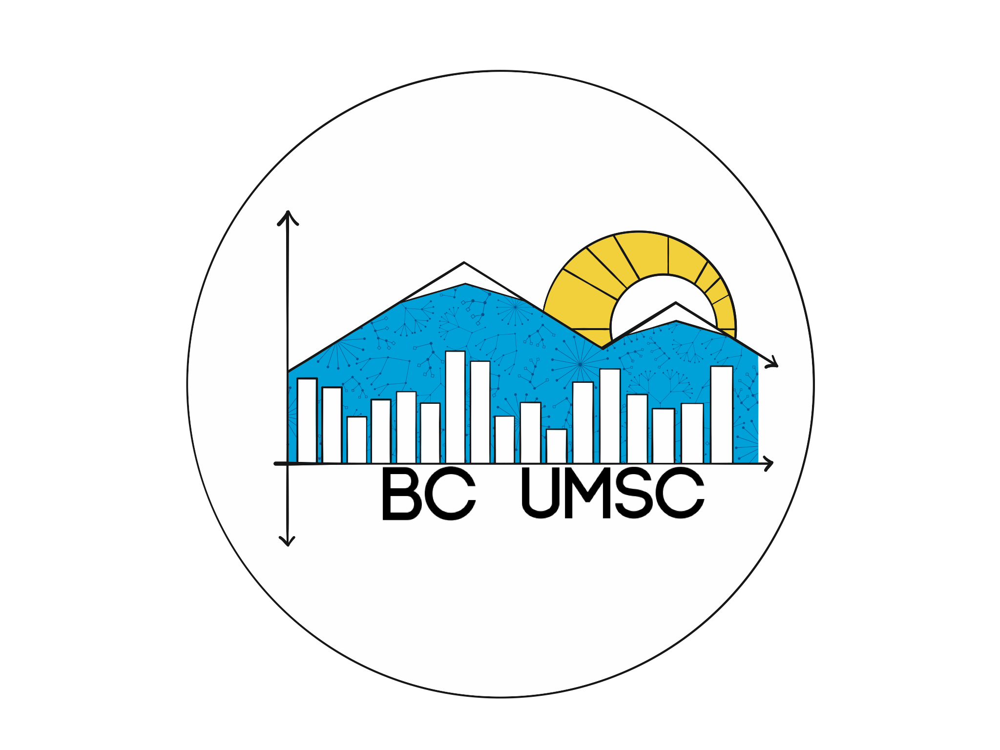
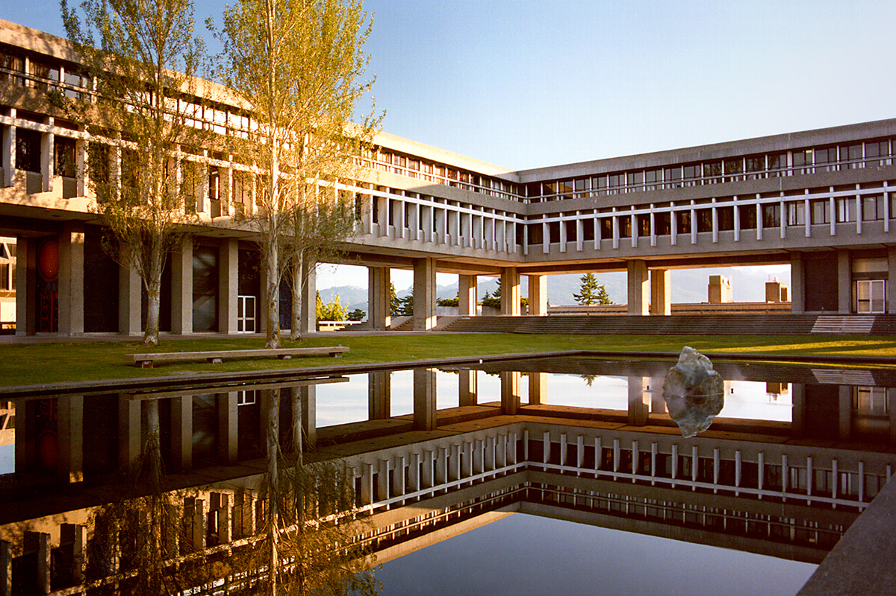
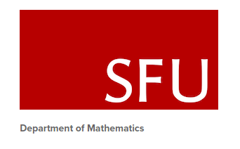
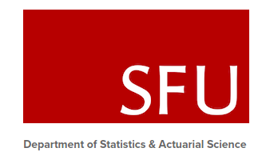
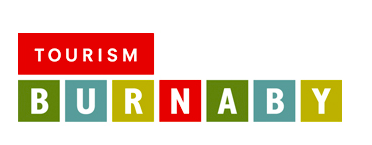

# BC-UMSC-Workshops
This repository contains workshop basic format and will serve as a common point to store workshops for BC UMSC

# About BC UMSC 

The British Columbia Undergraduate Mathematics and Statistics Conference (BC  UMSC)  is  the BC inaugural event taking place between April 25 - April 27 2019. Its purpose is to connect  undergraduate  mathematics  and  statistics students from across  BC with each other,  with professors,  and with  industry partners.   We  aim  to  create  quality  opportunities  for  accomplished  students to showcase their research and expand their learning.  Our conference will increase the reputations of universities across British Columbia as centres for statistics and mathematics excellence.

# Events 

## Data Visualization Competition

We will be hosting a data visualization competition. Key principles of data visualization will be provided. Students will then be assigned to groups of mixed universities and disciplines. They will then be given a few hours to produce a visualization from a real-world data set and compete for a cash prize. The aim of this competition is to create avenues for students to network withstudents from other universities and to give students more experience workingwith real-world data.

## Workshops

We will facilitate workshops in R, Maple or Matlab,Python,  Git, introduction to data science and Paper-writing.  We have chosen these programs as they are commonly used by Mathematics and Statistics students and we wish to include all of the invited participants in these workshops.

## Networking

We want to provide undergraduate students in Mathematics and Statistics an opportunity to meet other students, professors, organizers and industry members who have similar interests and goals. We will organize engaging and enjoyable activities for participants and sponsors so they can connect. Events involve a pub night,  movie night,  trivia night,  and/or short exploratory excursions to downtown Vancouver.  

# Venue

BC UMSC will be hosted at Simon Fraser University’s Burnaby Campus.

# Organizing Commitee

Alice Roberts (Co-Chair)

Kristen Bystrom (Co-Chair)

Nikola Surjanovic (Industry Partnership Coordinator)

Laura Gutierrez Funderburk (Grant Writer & Budgeting and Workshop Coordinator)

Linda Kingsman (Director of Internal Operations)

Sebastian Mora (Recruit and Liaise students)

Tianna Tso ( Director of Marketing)

Anya Phillip (Editor)

Maryam Labani (Volunteer Coordinator)

Zhi Yuh Ou Yang (Workshop Coordinator)

Bryce Haley (Webmaster)

Kelly Wallace (Graphic Designer)

Paige Tuttosi (Director of Events)

Mina Labani (Assitant to the Chairs)

# Sponsors 

